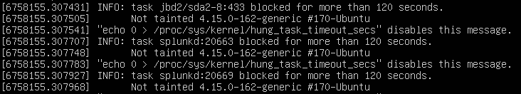

# INFO: task \<task\_name> blocked for more than 120 seconds.

## Cause

"hung tasks" are bugs that cause the kernel to leave a task stuck in uninterruptible "D" state. A task/process in that state cannot be killed, neither with `kill -9`.

## Solution

1. Reboot the system.&#x20;
2. Find out which resource the process needs, and make sure the resource is available. → Just increase resource.
